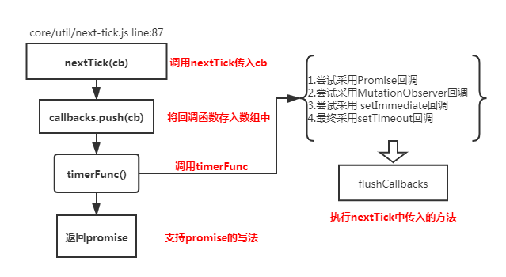
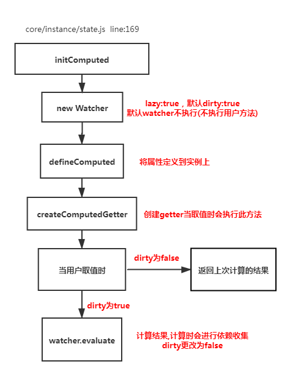
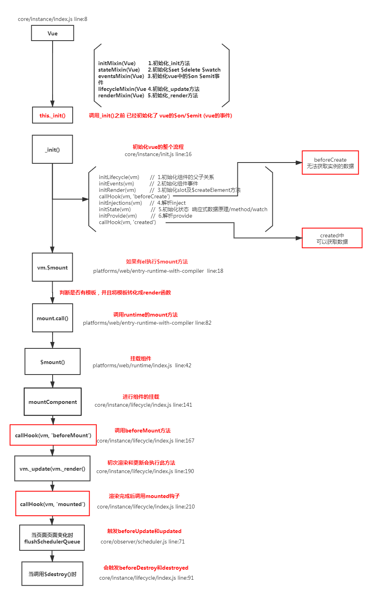

## 1.谈一下你对`MVVM `原理的理解


- 传统的`MVC`指的是,用户操作会请求服务端路由，路由会调用对应的控制器来处理,控制器会获取数据。将结果返回给前端,页面重新渲染
- `MVVM`:传统的前端会将数据手动渲染到页面上,`MVVM`模式不需要用户收到操作`dom`元素,将数据绑定到`viewModel`层上，会自动将数据渲染到页面中，视图变化会通知`viewModel层`更新数据。`ViewModel`就是我们`MVVM`模式中的桥梁.

## 2.请说一下响应式数据的原理？

### 理解:

- 1.核心点:`Object.defineProperty`
- 2.默认`Vue`在初始化数据时，会给`data`中的属性使用`Object.defineProperty`重新定义所有属性,当页面取到对应属性时。会进行依赖收集（收集当前组件的watcher） 如果属性发生变化会通知相关依赖进行更新操作。

### 原理:


```javascript
Object.defineProperty(obj, key, {
    enumerable: true,
    configurable: true,
    get: function reactiveGetter () {
      const value = getter ? getter.call(obj) : val
      if (Dep.target) {
        dep.depend() // ** 收集依赖 ** /
        if (childOb) {
          childOb.dep.depend()
          if (Array.isArray(value)) {
            dependArray(value)
          }
        }
      }
      return value
    },
    set: function reactiveSetter (newVal) {
      const value = getter ? getter.call(obj) : val
      if (newVal === value || (newVal !== newVal && value !== value)) {
        return
      }
      if (process.env.NODE_ENV !== 'production' && customSetter) {
        customSetter()
      }
      val = newVal
      childOb = !shallow && observe(newVal)
      dep.notify() /**通知相关依赖进行更新**/
    }
  })
```

## 3.`Vue`中是如何检测数组变化?

### 理解: 

- 使用函数劫持的方式，重写了数组的方法
- `Vue`将`data`中的数组，进行了原型链重写。指向了自己定义的数组原型方法，这样当调用数组`api`时，可以通知依赖更新.如果数组中包含着引用类型。会对数组中的引用类型再次进行监控。

### 原理:


```javascript
const arrayProto = Array.prototype
export const arrayMethods = Object.create(arrayProto)
const methodsToPatch = [
  'push',
  'pop',
  'shift',
  'unshift',
  'splice',
  'sort',
  'reverse'
]
methodsToPatch.forEach(function (method) { // 重写原型方法
  const original = arrayProto[method] // 调用原数组的方法
  def(arrayMethods, method, function mutator (...args) {
    const result = original.apply(this, args)
    const ob = this.__ob__
    let inserted
    switch (method) {
      case 'push':
      case 'unshift':
        inserted = args
        break
      case 'splice':
        inserted = args.slice(2)
        break
    }
    if (inserted) ob.observeArray(inserted)
    // notify change
    ob.dep.notify() // 当调用数组方法后，手动通知视图更新
    return result
  })
})

this.observeArray(value) // 进行深度监控
```

## 4.为何`Vue`采用异步渲染?

### 理解：  

因为如果不采用异步更新，那么每次更新数据都会对当前组件进行重新渲染.所以为了性能考虑。`Vue`会在本轮数据更新后，再去异步更新视图!

### 原理:


```javascript
update () {
    /* istanbul ignore else */
    if (this.lazy) {
      this.dirty = true
    } else if (this.sync) {
      this.run()
    } else {
      queueWatcher(this); // 当数据发生变化时会将watcher放到一个队列中批量更新
    }
}
export function queueWatcher (watcher: Watcher) {
  const id = watcher.id // 会对相同的watcher进行过滤
  if (has[id] == null) {
    has[id] = true
    if (!flushing) {
      queue.push(watcher)
    } else {
      let i = queue.length - 1
      while (i > index && queue[i].id > watcher.id) {
        i--
      }
      queue.splice(i + 1, 0, watcher)
    }
    // queue the flush
    if (!waiting) {
      waiting = true

      if (process.env.NODE_ENV !== 'production' && !config.async) {
        flushSchedulerQueue()
        return
      }
      nextTick(flushSchedulerQueue) // 调用nextTick方法 批量的进行更新
    }
  }
}
```

## 5.`nextTick`实现原理?

### 理解:(**宏任务**和**微任务**) 异步方法

`nextTick`方法主要是使用了**宏任务**和**微任务**,定义了一个异步方法.多次调用`nextTick` 会将方法存入队列中，通过这个异步方法清空当前队列。 所以这个`nextTick`方法就是异步方法

### 原理:



```javascript
let timerFunc  // 会定义一个异步方法
if (typeof Promise !== 'undefined' && isNative(Promise)) {  // promise
  const p = Promise.resolve()
  timerFunc = () => {
    p.then(flushCallbacks)
    if (isIOS) setTimeout(noop)
  }
  isUsingMicroTask = true
} else if (!isIE && typeof MutationObserver !== 'undefined' && ( // MutationObserver
  isNative(MutationObserver) ||
  MutationObserver.toString() === '[object MutationObserverConstructor]'
)) {
  let counter = 1
  const observer = new MutationObserver(flushCallbacks)
  const textNode = document.createTextNode(String(counter))
  observer.observe(textNode, {
    characterData: true
  })
  timerFunc = () => {
    counter = (counter + 1) % 2
    textNode.data = String(counter)
  }
  isUsingMicroTask = true
} else if (typeof setImmediate !== 'undefined' ) { // setImmediate
  timerFunc = () => {
    setImmediate(flushCallbacks)
  }
} else {
  timerFunc = () => {   // setTimeout
    setTimeout(flushCallbacks, 0)
  }
}
// nextTick实现
export function nextTick (cb?: Function, ctx?: Object) {
  let _resolve
  callbacks.push(() => {
    if (cb) {
      try {
        cb.call(ctx)
      } catch (e) {
        handleError(e, ctx, 'nextTick')
      }
    } else if (_resolve) {
      _resolve(ctx)
    }
  })
  if (!pending) {
    pending = true
    timerFunc()
  }
}

```

## 6.`Vue`中`Computed`的特点

### 理解:   

- 默认`computed`也是一个`watcher`是具备缓存的，只要当依赖的属性发生变化时才会更新视图

### 原理:



```javascript
function initComputed (vm: Component, computed: Object) {
  const watchers = vm._computedWatchers = Object.create(null)
  const isSSR = isServerRendering()
  for (const key in computed) {
    const userDef = computed[key]
    const getter = typeof userDef === 'function' ? userDef : userDef.get
    if (!isSSR) {
      // create internal watcher for the computed property.
      watchers[key] = new Watcher(
        vm,
        getter || noop,
        noop,
        computedWatcherOptions
      )
    }

    // component-defined computed properties are already defined on the
    // component prototype. We only need to define computed properties defined
    // at instantiation here.
    if (!(key in vm)) {
      defineComputed(vm, key, userDef)
    } else if (process.env.NODE_ENV !== 'production') {
      if (key in vm.$data) {
        warn(`The computed property "${key}" is already defined in data.`, vm)
      } else if (vm.$options.props && key in vm.$options.props) {
        warn(`The computed property "${key}" is already defined as a prop.`, vm)
      }
    }
  }
}
function createComputedGetter (key) {
  return function computedGetter () {
    const watcher = this._computedWatchers && this._computedWatchers[key]
    if (watcher) {
      if (watcher.dirty) { // 如果依赖的值没发生变化,就不会重新求值
        watcher.evaluate()
      }
      if (Dep.target) {
        watcher.depend()
      }
      return watcher.value
    }
  }
}
```

## 7.`Watch`中的`deep:true` 是如何实现的

### 理解:

- 当用户指定了`watch`中的deep属性为`true`时，如果当前监控的值是数组类型。会对对象中的每一项进行求值，此时会将当前`watcher`存入到对应属性的依赖中，这样数组中对象发生变化时也会通知数据更新

## 原理:

```javascript
get () {
    pushTarget(this) // 先将当前依赖放到 Dep.target上
    let value
    const vm = this.vm
    try {
      value = this.getter.call(vm, vm)
    } catch (e) {
      if (this.user) {
        handleError(e, vm, `getter for watcher "${this.expression}"`)
      } else {
        throw e
      }
    } finally {
      if (this.deep) { // 如果需要深度监控
        traverse(value) // 会对对象中的每一项取值,取值时会执行对应的get方法
      }
      popTarget()
    }
    return value
}
function _traverse (val: any, seen: SimpleSet) {
  let i, keys
  const isA = Array.isArray(val)
  if ((!isA && !isObject(val)) || Object.isFrozen(val) || val instanceof VNode) {
    return
  }
  if (val.__ob__) {
    const depId = val.__ob__.dep.id
    if (seen.has(depId)) {
      return
    }
    seen.add(depId)
  }
  if (isA) {
    i = val.length
    while (i--) _traverse(val[i], seen)
  } else {
    keys = Object.keys(val)
    i = keys.length
    while (i--) _traverse(val[keys[i]], seen)
  }
}

```

## 8.`Vue`组件的生命周期

### 理解:

#### 要掌握每个生命周期什么时候被调用

- `beforeCreate` 在实例初始化之后，数据观测(data observer) 之前被调用。
- `created` 实例已经创建完成之后被调用。在这一步，实例已完成以下的配置：数据观测(data observer)，属性和方法的运算， watch/event 事件回调。这里没有$el
- `beforeMount` 在挂载开始之前被调用：相关的 render 函数首次被调用。
- `mounted` el 被新创建的 `vm.$el` 替换，并挂载到实例上去之后调用该钩子。
- `beforeUpdate` 数据更新时调用，发生在虚拟 DOM 重新渲染和打补丁之前。
- `updated` 由于数据更改导致的虚拟 DOM 重新渲染和打补丁，在这之后会调用该钩子。
- `beforeDestroy` 实例销毁之前调用。在这一步，实例仍然完全可用。
- `destroyed` `Vue` 实例销毁后调用。调用后，`Vue` 实例指示的所有东西都会解绑定，所有的事件监听器会被移除，所有的子实例也会被销毁。 该钩子在服务器端渲染期间不被调用。

#### 要掌握每个生命周期内部可以做什么事

- `created` 实例已经创建完成，因为它是最早触发的原因可以进行一些数据，资源的请求。
- `mounted` 实例已经挂载完成，可以进行一些DOM操作
- `beforeUpdate` 可以在这个钩子中进一步地更改状态，这不会触发附加的重渲染过程。
- `updated` 可以执行依赖于 DOM 的操作。然而在大多数情况下，你应该避免在此期间更改状态，因为这可能会导致更新无限循环。 该钩子在服务器端渲染期间不被调用。
- `destroyed` 可以执行一些优化操作,清空定时器，解除绑定事件


### 原理:



## 9.`ajax`请求放在哪个生命周期中

### 理解:

-  在created的时候，视图中的`dom`并没有渲染出来，所以此时如果直接去操`dom`节点，无法找到相关的元素 
-  在mounted中，由于此时`dom`已经渲染出来了，所以可以直接操作`dom`节点 

一般情况下都放到`mounted`中,保证逻辑的统一性,因为生命周期是同步执行的，`ajax`是异步执行的

> 服务端渲染不支持mounted方法，所以在服务端渲染的情况下统一放到created中

## 10.何时需要使用`beforeDestroy`

### 理解:

- 可能在当前页面中使用了`$on`方法，那需要在组件销毁前解绑。
- 清除自己定义的定时器
- 解除事件的绑定 `scroll mousemove ....`

## 11.`Vue`中模板编译原理 

- 将`template`转化成`render`函数

```javascript
function baseCompile (
  template: string,
  options: CompilerOptions
) {
  const ast = parse(template.trim(), options) // 1.将模板转化成ast语法树
  if (options.optimize !== false) {           // 2.优化树
    optimize(ast, options)
  }
  const code = generate(ast, options)         // 3.生成树
  return {
    ast,
    render: code.render,
    staticRenderFns: code.staticRenderFns
  }
})
```

```javascript
const ncname = `[a-zA-Z_][\\-\\.0-9_a-zA-Z]*`; 
const qnameCapture = `((?:${ncname}\\:)?${ncname})`;
const startTagOpen = new RegExp(`^<${qnameCapture}`); // 标签开头的正则 捕获的内容是标签名
const endTag = new RegExp(`^<\\/${qnameCapture}[^>]*>`); // 匹配标签结尾的  </div>
const attribute = /^\s*([^\s"'<>\/=]+)(?:\s*(=)\s*(?:"([^"]*)"+|'([^']*)'+|([^\s"'=<>`]+)))?/; // 匹配属性的
const startTagClose = /^\s*(\/?)>/; // 匹配标签结束的  >
let root;
let currentParent;
let stack = []
function createASTElement(tagName,attrs){
    return {
        tag:tagName,
        type:1,
        children:[],
        attrs,
        parent:null
    }
}
function start(tagName,attrs){
    let element = createASTElement(tagName,attrs);
    if(!root){
        root = element;
    }
    currentParent = element;
    stack.push(element);
}
function chars(text){
    currentParent.children.push({
        type:3,
        text
    })
}
function end(tagName){
    const element = stack[stack.length-1];
    stack.length --; 
    currentParent = stack[stack.length-1];
    if(currentParent){
        element.parent = currentParent;
        currentParent.children.push(element)
    }
}
function parseHTML(html){
    while(html){
        let textEnd = html.indexOf('<');
        if(textEnd == 0){
            const startTagMatch = parseStartTag();
            if(startTagMatch){
                start(startTagMatch.tagName,startTagMatch.attrs);
                continue;
            }
            const endTagMatch = html.match(endTag);
            if(endTagMatch){
                advance(endTagMatch[0].length);
                end(endTagMatch[1])
            }
        }
        let text;
        if(textEnd >=0 ){
            text = html.substring(0,textEnd)
        }
        if(text){
            advance(text.length);
            chars(text);
        }
    }
    function advance(n) {
        html = html.substring(n);
    }
    function parseStartTag(){
        const start = html.match(startTagOpen);
        if(start){
            const match = {
                tagName:start[1],
                attrs:[]
            }
            advance(start[0].length);
            let attr,end
            while(!(end = html.match(startTagClose)) && (attr=html.match(attribute))){
                advance(attr[0].length);
                match.attrs.push({name:attr[1],value:attr[3]})
            }
            if(end){
                advance(end[0].length);
                return match
            }
        }
    }
}
// 生成语法树
parseHTML(`<div id="container"><p>hello<span>zf</span></p></div>`);
function gen(node){
    if(node.type == 1){
        return generate(node);
    }else{
        return `_v(${JSON.stringify(node.text)})`
    }
}
function genChildren(el){
    const children = el.children;
    if(el.children){
        return `[${children.map(c=>gen(c)).join(',')}]`
    }else{
        return false;
    }
}
function genProps(attrs){
    let str = '';
    for(let i = 0; i < attrs.length;i++){
        let attr = attrs[i];
        str+= `${attr.name}:${attr.value},`;
    }
    return `{attrs:{${str.slice(0,-1)}}}`
}
function generate(el){
    let children = genChildren(el);
    let code = `_c('${el.tag}'${
        el.attrs.length? `,${genProps(el.attrs)}`:''
    }${
        children? `,${children}`:''
    })`;
    return code;
}
// 根据语法树生成新的代码
let code = generate(root);
let render = `with(this){return ${code}}`;

// 包装成函数
let renderFn = new Function(render);
console.log(renderFn.toString());
```

## 12.`Vue`中`v-if`和`v-show`的区别

### 理解:

- `v-if`如果条件不成立不会渲染当前指令所在节点的`dom`元素
- `v-show`只是切换当前`dom`的显示或者隐藏

### 原理:

```javascript
const VueTemplateCompiler = require('vue-template-compiler');
let r1 = VueTemplateCompiler.compile(`<div v-if="true"><span v-for="i in 3">hello</span></div>`);
/**
with(this) {
    return (true) ? _c('div', _l((3), function (i) {
        return _c('span', [_v("hello")])
    }), 0) : _e()
}
*/
```

```js
const VueTemplateCompiler = require('vue-template-compiler');
let r2 = VueTemplateCompiler.compile(`<div v-show="true"></div>`);
/**
with(this) {
    return _c('div', {
        directives: [{
            name: "show",
            rawName: "v-show",
            value: (true),
            expression: "true"
        }]
    })
}
 */

// v-show 操作的是样式  定义在platforms/web/runtime/directives/show.js
bind (el: any, { value }: VNodeDirective, vnode: VNodeWithData) {
    vnode = locateNode(vnode)
    const transition = vnode.data && vnode.data.transition
    const originalDisplay = el.__vOriginalDisplay =
      el.style.display === 'none' ? '' : el.style.display
    if (value && transition) {
      vnode.data.show = true
      enter(vnode, () => {
        el.style.display = originalDisplay
      })
    } else {
      el.style.display = value ? originalDisplay : 'none'
    }
}
```


## 13.为什么`V-for`和`v-if`不能连用

### 理解:

```javascript
const VueTemplateCompiler = require('vue-template-compiler');
let r1 = VueTemplateCompiler.compile(`<div v-if="false" v-for="i in 3">hello</div>`);
/**
with(this) {
    return _l((3), function (i) {
        return (false) ? _c('div', [_v("hello")]) : _e()
    })
}
*/
console.log(r1.render);
```

- `v-for`会比`v-if`的优先级高一些,如果连用的话会把`v-if`给每个元素都添加一下,会造成性能问题

## 14.用`vnode`来描述一个`DOM`结构

- 虚拟节点就是用一个对象来描述真实的`dom`元素

```javascript
function $createElement(tag,data,...children){
    let key = data.key;
    delete data.key;
    children = children.map(child=>{
        if(typeof child === 'object'){
            return child
        }else{
            return vnode(undefined,undefined,undefined,undefined,child)
        }
    })
    return vnode(tag,props,key,children);
} 
export function vnode(tag,data,key,children,text){
    return {
        tag, // 表示的是当前的标签名
        data, // 表示的是当前标签上的属性
        key, // 唯一表示用户可能传递
        children,
        text
    }
}
```

## 15.`diff`算法的时间复杂度

 两个树的完全的`diff`算法是一个时间复杂度为 `O(n3) `,`Vue`进行了优化·*O(n3)* *复杂度*的问题转换成 O(n) *复杂度*的问题(只比较同级不考虑跨级问题)  在前端当中， 你很少会跨越层级地移动Dom元素。 所以 Virtual Dom只会对同一个层级的元素进行对比。 

## 16.简述`Vue`中`diff`算法原理 

### 理解：

- 1.先同级比较，在比较子节点
- 2.先判断一方有儿子一方没儿子的情况 
- 3.比较都有儿子的情况
- 4.递归比较子节点


### 原理:

> `core/vdom/patch.js`

```js
const oldCh = oldVnode.children // 老的儿子 
const ch = vnode.children  // 新的儿子
if (isUndef(vnode.text)) {
    if (isDef(oldCh) && isDef(ch)) {
        // 比较孩子
        if (oldCh !== ch) updateChildren(elm, oldCh, ch, insertedVnodeQueue, removeOnly)
    } else if (isDef(ch)) { // 新的儿子有 老的没有
        if (isDef(oldVnode.text)) nodeOps.setTextContent(elm, '')
        addVnodes(elm, null, ch, 0, ch.length - 1, insertedVnodeQueue)
    } else if (isDef(oldCh)) { // 如果老的有新的没有 就删除
        removeVnodes(oldCh, 0, oldCh.length - 1)
    } else if (isDef(oldVnode.text)) {  // 老的有文本 新的没文本
        nodeOps.setTextContent(elm, '') // 将老的清空
    }
} else if (oldVnode.text !== vnode.text) { // 文本不相同替换
    nodeOps.setTextContent(elm, vnode.text)
}
```

```js
function updateChildren (parentElm, oldCh, newCh, insertedVnodeQueue, removeOnly) {
    let oldStartIdx = 0
    let newStartIdx = 0
    let oldEndIdx = oldCh.length - 1
    let oldStartVnode = oldCh[0]
    let oldEndVnode = oldCh[oldEndIdx]
    let newEndIdx = newCh.length - 1
    let newStartVnode = newCh[0]
    let newEndVnode = newCh[newEndIdx]
    let oldKeyToIdx, idxInOld, vnodeToMove, refElm

    // removeOnly is a special flag used only by <transition-group>
    // to ensure removed elements stay in correct relative positions
    // during leaving transitions
    const canMove = !removeOnly

    if (process.env.NODE_ENV !== 'production') {
      checkDuplicateKeys(newCh)
    }

    while (oldStartIdx <= oldEndIdx && newStartIdx <= newEndIdx) {
      if (isUndef(oldStartVnode)) {
        oldStartVnode = oldCh[++oldStartIdx] // Vnode has been moved left
      } else if (isUndef(oldEndVnode)) {
        oldEndVnode = oldCh[--oldEndIdx]
      } else if (sameVnode(oldStartVnode, newStartVnode)) {
        patchVnode(oldStartVnode, newStartVnode, insertedVnodeQueue, newCh, newStartIdx)
        oldStartVnode = oldCh[++oldStartIdx]
        newStartVnode = newCh[++newStartIdx]
      } else if (sameVnode(oldEndVnode, newEndVnode)) {
        patchVnode(oldEndVnode, newEndVnode, insertedVnodeQueue, newCh, newEndIdx)
        oldEndVnode = oldCh[--oldEndIdx]
        newEndVnode = newCh[--newEndIdx]
      } else if (sameVnode(oldStartVnode, newEndVnode)) { // Vnode moved right
        patchVnode(oldStartVnode, newEndVnode, insertedVnodeQueue, newCh, newEndIdx)
        canMove && nodeOps.insertBefore(parentElm, oldStartVnode.elm, nodeOps.nextSibling(oldEndVnode.elm))
        oldStartVnode = oldCh[++oldStartIdx]
        newEndVnode = newCh[--newEndIdx]
      } else if (sameVnode(oldEndVnode, newStartVnode)) { // Vnode moved left
        patchVnode(oldEndVnode, newStartVnode, insertedVnodeQueue, newCh, newStartIdx)
        canMove && nodeOps.insertBefore(parentElm, oldEndVnode.elm, oldStartVnode.elm)
        oldEndVnode = oldCh[--oldEndIdx]
        newStartVnode = newCh[++newStartIdx]
      } else {
        if (isUndef(oldKeyToIdx)) oldKeyToIdx = createKeyToOldIdx(oldCh, oldStartIdx, oldEndIdx)
        idxInOld = isDef(newStartVnode.key)
          ? oldKeyToIdx[newStartVnode.key]
          : findIdxInOld(newStartVnode, oldCh, oldStartIdx, oldEndIdx)
        if (isUndef(idxInOld)) { // New element
          createElm(newStartVnode, insertedVnodeQueue, parentElm, oldStartVnode.elm, false, newCh, newStartIdx)
        } else {
          vnodeToMove = oldCh[idxInOld]
          if (sameVnode(vnodeToMove, newStartVnode)) {
            patchVnode(vnodeToMove, newStartVnode, insertedVnodeQueue, newCh, newStartIdx)
            oldCh[idxInOld] = undefined
            canMove && nodeOps.insertBefore(parentElm, vnodeToMove.elm, oldStartVnode.elm)
          } else {
            // same key but different element. treat as new element
            createElm(newStartVnode, insertedVnodeQueue, parentElm, oldStartVnode.elm, false, newCh, newStartIdx)
          }
        }
        newStartVnode = newCh[++newStartIdx]
      }
    }
    if (oldStartIdx > oldEndIdx) {
      refElm = isUndef(newCh[newEndIdx + 1]) ? null : newCh[newEndIdx + 1].elm
      addVnodes(parentElm, refElm, newCh, newStartIdx, newEndIdx, insertedVnodeQueue)
    } else if (newStartIdx > newEndIdx) {
      removeVnodes(oldCh, oldStartIdx, oldEndIdx)
    }
  }
```


## 17.`v-for`中为什么要用`key` (图解)


## 18.描述组件渲染和更新过程

### 理解：

- 渲染组件时，会通过`Vue.extend`方法构建子组件的构造函数，并进行实例化。最终手动调用`$mount()`进行挂载。更新组件时会进行`patchVnode`流程.核心就是diff算法


## 19.组件中的 `data`为什么是一个函数? 

### 理解：

同一个组件被复用多次，会创建多个实例。这些实例用的是同一个构造函数，如果`data`是一个对象的话。那么所有组件都共享了同一个对象。为了保证组件的数据独立性要求每个组件必须通过`data`函数返回一个对象作为组件的状态。

### 原理:

> `core/global-api/extend.js line:33`

```javascript
Sub.options = mergeOptions(
      Super.options,
      extendOptions
)
function mergeOptions(){
 	 function mergeField (key) {
        const strat = strats[key] || defaultStrat
        options[key] = strat(parent[key], child[key], vm, key)
     }
}
strats.data = function ( 
  parentVal: any,
  childVal: any,
  vm?: Component
): ?Function {
  if (!vm) { // 合并是会判断子类的data必须是一个函数
    if (childVal && typeof childVal !== 'function') {
      process.env.NODE_ENV !== 'production' && warn(
        'The "data" option should be a function ' +
        'that returns a per-instance value in component ' +
        'definitions.',
        vm
      )

      return parentVal
    }
    return mergeDataOrFn(parentVal, childVal)
  }
  return mergeDataOrFn(parentVal, childVal, vm)
}
```

- 一个组件被使用多次，用的都是同一个构造函数。为了保证组件的不同的实例data不冲突，要求data必须是一个函数，这样组件间不会相互影响

## 20.`Vue`中事件绑定的原理 

### 理解:

- 1.原生`dom`事件的绑定,采用的是`addEventListener`实现
- 2.组件绑定事件采用的是`$on`方法

### 原理:

- 事件的编译：

```js
let compiler = require('vue-template-compiler');
let r1 = compiler.compile('<div @click="fn()"></div>');
let r2 = compiler.compile('<my-component @click.native="fn" @click="fn1"></my-component>');
console.log(r1); // {on:{click}}
console.log(r2); // {nativeOnOn:{click},on:{click}}  
```


#### 1.原生`dom`的绑定

- `Vue`在创建真是`dom`时会调用`createElm`,默认会调用`invokeCreateHooks`
- 会遍历当前平台下相对的属性处理代码,其中就有`updateDOMListeners`方法,内部会传入`add`方法

yuan

```js
function updateDOMListeners (oldVnode: VNodeWithData, vnode: VNodeWithData) {
  if (isUndef(oldVnode.data.on) && isUndef(vnode.data.on)) {
    return
  }
  const on = vnode.data.on || {}
  const oldOn = oldVnode.data.on || {}
  target = vnode.elm
  normalizeEvents(on)
  updateListeners(on, oldOn, add, remove, createOnceHandler, vnode.context)
  target = undefined
}

function add (
  name: string,
  handler: Function,
  capture: boolean,
  passive: boolean
) {
  target.addEventListener( // 给当前的dom添加事件
    name,
    handler,
    supportsPassive
      ? { capture, passive }
      : capture
  )
}
```

>  `vue`中绑定事件是直接绑定给真实`dom`元素的

- 2.组件中绑定事件

```javascript
export function updateComponentListeners (
  vm: Component,
  listeners: Object,
  oldListeners: ?Object
) {
  target = vm
  updateListeners(listeners, oldListeners || {}, add, remove, createOnceHandler, vm)
  target = undefined
}
function add (event, fn) {
  target.$on(event, fn)
}

```

> 组件绑定事件是通过`vue`中自定义的`$on`方法来实现的

## 21.`v-model`中的实现原理及如何自定义`v-model`

### 理解:

组件的`v-model`是`value+input方法`的语法糖

```html
<el-checkbox :value="" @input=""></el-checkbox>
<el-checkbox v-model="check"></el-checkbox>
```

可以自己重新定义`v-model`的含义

```javascript
Vue.component('el-checkbox',{
    template:`<input type="checkbox" :checked="check" @change="$emit('change',$event.target.checked)">`,
    model:{
        prop:'check', // 更改默认的value的名字
        event:'change' // 更改默认的方法名
    },
    props: {
        check: Boolean
    },
})
```

### 原理:

- 会将组件的`v-model`默认转化成value+input

```js
const VueTemplateCompiler = require('vue-template-compiler');
const ele = VueTemplateCompiler.compile('<el-checkbox v-model="check"></el-checkbox>');
// with(this) {
//     return _c('el-checkbox', {
//         model: {
//             value: (check),
//             callback: function ($$v) {
//                 check = $$v
//             },
//             expression: "check"
//         }
//     })
// }
```

> `core/vdom/create-component.js  line:155`

```javascript
function transformModel (options, data: any) {
  const prop = (options.model && options.model.prop) || 'value'
  const event = (options.model && options.model.event) || 'input'
  ;(data.attrs || (data.attrs = {}))[prop] = data.model.value
  const on = data.on || (data.on = {})
  const existing = on[event]
  const callback = data.model.callback
  if (isDef(existing)) {
    if (
      Array.isArray(existing)
        ? existing.indexOf(callback) === -1
        : existing !== callback
    ) {
      on[event] = [callback].concat(existing)
    }
  } else {
    on[event] = callback
  }
}
```

- 原生的 `v-model`，会根据标签的不同生成不同的事件和属性

```js
const VueTemplateCompiler = require('vue-template-compiler');
const ele = VueTemplateCompiler.compile('<input v-model="value"/>');
/** 
with(this) {
    return _c('input', {
        directives: [{
            name: "model",
            rawName: "v-model",
            value: (value),
            expression: "value"
        }],
        domProps: {
            "value": (value)
        },
        on: {
            "input": function ($event) {
                if ($event.target.composing) return;
                value = $event.target.value
            }
        }
    })
}
*/

```

> 编译时：不同的标签解析出的内容不一样 `platforms/web/compiler/directives/model.js`

```javascript
if (el.component) {
    genComponentModel(el, value, modifiers)
    // component v-model doesn't need extra runtime
    return false
  } else if (tag === 'select') {
    genSelect(el, value, modifiers)
  } else if (tag === 'input' && type === 'checkbox') {
    genCheckboxModel(el, value, modifiers)
  } else if (tag === 'input' && type === 'radio') {
    genRadioModel(el, value, modifiers)
  } else if (tag === 'input' || tag === 'textarea') {
    genDefaultModel(el, value, modifiers)
  } else if (!config.isReservedTag(tag)) {
    genComponentModel(el, value, modifiers)
    // component v-model doesn't need extra runtime
    return false
  }
```

> 运行时：会对元素处理一些关于输入法的问题 `platforms/web/runtime/directives/model.js`

```js
inserted (el, binding, vnode, oldVnode) {
    if (vnode.tag === 'select') {
      // #6903
      if (oldVnode.elm && !oldVnode.elm._vOptions) {
        mergeVNodeHook(vnode, 'postpatch', () => {
          directive.componentUpdated(el, binding, vnode)
        })
      } else {
        setSelected(el, binding, vnode.context)
      }
      el._vOptions = [].map.call(el.options, getValue)
    } else if (vnode.tag === 'textarea' || isTextInputType(el.type)) {
      el._vModifiers = binding.modifiers
      if (!binding.modifiers.lazy) {
        el.addEventListener('compositionstart', onCompositionStart)
        el.addEventListener('compositionend', onCompositionEnd)
        // Safari < 10.2 & UIWebView doesn't fire compositionend when
        // switching focus before confirming composition choice
        // this also fixes the issue where some browsers e.g. iOS Chrome
        // fires "change" instead of "input" on autocomplete.
        el.addEventListener('change', onCompositionEnd)
        /* istanbul ignore if */
        if (isIE9) {
          el.vmodel = true
        }
      }
    }
  }
```

## 22.`Vue`中`v-html`会导致哪些问题?

### 理解:

- 可能会导致`xss`攻击
- `v-html`会替换掉标签内部的子元素

### 原理:

```javascript
let template = require('vue-template-compiler');
let r = template.compile(`<div v-html="'<span>hello</span>'"></div>`)
// with(this){return _c('div',{domProps:{"innerHTML":_s('<span>hello</span>')}})}
console.log(r.render);

// _c 定义在core/instance/render.js
// _s 定义在core/instance/render-helpers/index,js

if (key === 'textContent' || key === 'innerHTML') {
      if (vnode.children) vnode.children.length = 0
      if (cur === oldProps[key]) continue
      // #6601 work around Chrome version <= 55 bug where single textNode
      // replaced by innerHTML/textContent retains its parentNode property
      if (elm.childNodes.length === 1) {
        elm.removeChild(elm.childNodes[0])
      }
}
```

## 23.  `Vue`父子组件生命周期调用顺序 

### 理解:

组件的调用顺序都是先父后子,渲染完成的顺序肯定是先子后父

组件的销毁操作是先父后子，销毁完成的顺序是先子后父

### 原理:


```javascript
function patch (oldVnode, vnode, hydrating, removeOnly) {
    if (isUndef(vnode)) {
      if (isDef(oldVnode)) invokeDestroyHook(oldVnode)
      return
    }

    let isInitialPatch = false
    const insertedVnodeQueue = [] // 定义收集所有组件的insert hook方法的数组
    // somthing ...
    createElm(
        vnode,
        insertedVnodeQueue,
        oldElm._leaveCb ? null : parentElm,
        nodeOps.nextSibling(oldElm)
    )
	// somthing...
    // 最终会依次调用收集的insert hook
    invokeInsertHook(vnode, insertedVnodeQueue, isInitialPatch);
    
    return vnode.elm
}
function createElm (
    vnode,
    insertedVnodeQueue,
    parentElm,
    refElm,
    nested,
    ownerArray,
    index
  ) {
        // createChildren会递归创建儿子组件
        createChildren(vnode, children, insertedVnodeQueue) 
        // something...
  }

// 将组件的vnode插入到数组中
function invokeCreateHooks (vnode, insertedVnodeQueue) {
    for (let i = 0; i < cbs.create.length; ++i) {
      cbs.create[i](emptyNode, vnode)
    }
    i = vnode.data.hook // Reuse variable
    if (isDef(i)) {
      if (isDef(i.create)) i.create(emptyNode, vnode)
      if (isDef(i.insert)) insertedVnodeQueue.push(vnode)
    }
  }
// insert方法中会依次调用mounted方法
insert (vnode: MountedComponentVNode) {
    const { context, componentInstance } = vnode
    if (!componentInstance._isMounted) {
      componentInstance._isMounted = true
      callHook(componentInstance, 'mounted')
    }
}

function invokeInsertHook (vnode, queue, initial) {
     // delay insert hooks for component root nodes, invoke them after the
     // element is really inserted
     if (isTrue(initial) && isDef(vnode.parent)) {
         vnode.parent.data.pendingInsert = queue
     } else {
         for (let i = 0; i < queue.length; ++i) {
             queue[i].data.hook.insert(queue[i]); // 调用insert方法
         }
     }
}
```

```javascript
Vue.prototype.$destroy = function () {
    callHook(vm, 'beforeDestroy') // 
    // invoke destroy hooks on current rendered tree
    vm.__patch__(vm._vnode, null) // 先销毁儿子 
    // fire destroyed hook
    callHook(vm, 'destroyed')
}
```

## 24.`Vue`组件如何通信?

- 父子间通信  父->子通过`props`、子-> 父`$on、$emit`
- 获取父子组件实例的方式`$parent、$children`
- 在父组件中提供数据子组件进行消费 `Provide、inject`
- `Ref`获取实例的方式调用组件的属性或者方法
- `Event Bus` 实现跨组件通信
- `Vuex `状态管理实现通信

## 25.`Vue`中相同逻辑如何抽离？

- `Vue.mixin`用法 给组件每个生命周期，函数等都混入一些公共逻辑

```javascript
Vue.mixin = function (mixin: Object) {
    this.options = mergeOptions(this.options, mixin); // 将当前定义的属性合并到每个组件中
    return this
}
export function mergeOptions (
  parent: Object,
  child: Object,
  vm?: Component
): Object {
  if (!child._base) {
    if (child.extends) { // 递归合并extends
      parent = mergeOptions(parent, child.extends, vm)
    }
    if (child.mixins) { // 递归合并mixin
      for (let i = 0, l = child.mixins.length; i < l; i++) {
        parent = mergeOptions(parent, child.mixins[i], vm)
      }
    }
  }
  const options = {} // 属性及生命周期的合并
  let key
  for (key in parent) {
    mergeField(key)
  }
  for (key in child) {
    if (!hasOwn(parent, key)) {
      mergeField(key)
    }
  }
  function mergeField (key) {
    const strat = strats[key] || defaultStrat
    // 调用不同属性合并策略进行合并
    options[key] = strat(parent[key], child[key], vm, key)
  }
  return options
}
```

## 26.为什么要使用异步组件？

### 理解:

- 如果组件功能多打包出的结果会变大，我可以采用异步的方式来加载组件。主要依赖`import()`这个语法，可以实现文件的分割加载。

  ```javascript
  components:{
  	AddCustomerSchedule(resolve) {
          require(["../components/AddCustomer"], resolve);
      }
  }
  ```

### 原理:

```javascript
export function createComponent (
  Ctor: Class<Component> | Function | Object | void,
  data: ?VNodeData,
  context: Component,
  children: ?Array<VNode>,
  tag?: string
): VNode | Array<VNode> | void {

  // async component
  let asyncFactory
  if (isUndef(Ctor.cid)) {
    asyncFactory = Ctor
    Ctor = resolveAsyncComponent(asyncFactory, baseCtor) // 默认调用此函数时返回undefiend
    // 第二次渲染时Ctor不为undefined
    if (Ctor === undefined) {
      return createAsyncPlaceholder( // 渲染占位符 空虚拟节点
        asyncFactory,
        data,
        context,
        children,
        tag
      )
    }
  }
}
function resolveAsyncComponent (
  factory: Function,
  baseCtor: Class<Component>
): Class<Component> | void {
  if (isDef(factory.resolved)) { // 3.在次渲染时可以拿到获取的最新组件
    return factory.resolved
  }
  const resolve = once((res: Object | Class<Component>) => {
      factory.resolved = ensureCtor(res, baseCtor)
      if (!sync) {
        forceRender(true) //2. 强制更新视图重新渲染
      } else {
        owners.length = 0
      }
  })
  const reject = once(reason => {
      if (isDef(factory.errorComp)) {
          factory.error = true
          forceRender(true)
      }
  })
  const res = factory(resolve, reject)// 1.将resolve方法和reject方法传入，用户调用resolve方法后
  sync = false
  return factory.resolved
}
```

## 27.什么是作用域插槽? 

### 理解:

#### 1.插槽：

- 创建组件虚拟节点时，会将组件的儿子的虚拟节点保存起来。当初始化组件时,通过插槽属性将儿子进行分类 `{a:[vnode],b[vnode]}`
- 渲染组件时会拿对应的slot属性的节点进行替换操作。（插槽的作用域为父组件）

#### 2.作用域插槽:

- 作用域插槽在解析的时候，不会作为组件的孩子节点。会解析成函数，当子组件渲染时，会调用此函数进行渲染。（插槽的作用域为子组件）

### 原理:


#### 1.插槽:

```js
const VueTemplateCompiler = require('vue-template-compiler');
let ele = VueTemplateCompiler.compile(`
    <my-component>
        <div slot="header">node</div>
        <div>react</div>
        <div slot="footer">vue</div>
    </my-component>
`)
/** 
with(this) {
    return _c('my-component', [_c('div', {
        attrs: {
            "slot": "header"
        },
        slot: "header"
    }, [_v("node")]), _v(" "), _c('div', [_v("react")]), _v(" "), _c('div', {
        attrs: {
            "slot": "footer"
        },
        slot: "footer"
    }, [_v("vue")])])
}
*/

const VueTemplateCompiler = require('vue-template-compiler');
let ele = VueTemplateCompiler.compile(`
    <div>
        <slot name="header"></slot>
        <slot name="footer"></slot>
        <slot></slot>
    </div>
`);
/**
with(this) {
    return _c('div', [_t("header"), _v(" "), _t("footer"), _v(" "), _t("default")], 2)
}
**/
// _t定义在 core/instance/render-helpers/index.js
```

### 作用域插槽:

```js

let ele = VueTemplateCompiler.compile(`
    <app>
        <div slot-scope="msg" slot="footer">{{msg.a}}</div>
    </app>
`);
/**
with(this) {
    return _c('app', {
        scopedSlots: _u([{ // 作用域插槽的内容会被渲染成一个函数
            key: "footer",
            fn: function (msg) {
                return _c('div', {}, [_v(_s(msg.a))])
            }
        }])
    })
	}
}
*/
const VueTemplateCompiler = require('vue-template-compiler');

VueTemplateCompiler.compile(`
    <div>
        <slot name="footer" a="1" b="2"></slot>
    </div>
`);
/**
with(this) {
    return _c('div', [_t("footer", null, {
        "a": "1",
        "b": "2"
    })], 2)
}
**/
```

## 28.谈谈你对 keep-alive 的了解？ 

### 理解:

`keep-alive`可以实现组件的缓存，当组件切换时不会对当前组件进行卸载,常用的2个属性`include`/`exclude`,2个生命周期`activated`,`deactivated`

### 原理:

> `core/components/keep-alive.js`

```js
export default {
  name: 'keep-alive',
  abstract: true, // 抽象组件

  props: {
    include: patternTypes,
    exclude: patternTypes,
    max: [String, Number]
  },

  created () {
    this.cache = Object.create(null) // 创建缓存列表
    this.keys = [] // 创建缓存组件的key列表
  },

  destroyed () { // keep-alive销毁时 会清空所有的缓存和key
    for (const key in this.cache) { // 循环销毁
      pruneCacheEntry(this.cache, key, this.keys)
    }
  },

  mounted () { // 会监控include 和 include属性 进行组件的缓存处理
    this.$watch('include', val => {
      pruneCache(this, name => matches(val, name))
    })
    this.$watch('exclude', val => {
      pruneCache(this, name => !matches(val, name))
    })
  },

  render () {
    const slot = this.$slots.default // 会默认拿插槽
    const vnode: VNode = getFirstComponentChild(slot) // 只缓存第一个组件
    const componentOptions: ?VNodeComponentOptions = vnode && vnode.componentOptions
    if (componentOptions) {
      // check pattern
      const name: ?string = getComponentName(componentOptions) // 取出组件的名字
      const { include, exclude } = this
      if ( // 判断是否缓存
        // not included
        (include && (!name || !matches(include, name))) ||
        // excluded
        (exclude && name && matches(exclude, name))
      ) {
        return vnode
      }

      const { cache, keys } = this
      const key: ?string = vnode.key == null
        // same constructor may get registered as different local components
        // so cid alone is not enough (#3269)
        ? componentOptions.Ctor.cid + (componentOptions.tag ? `::${componentOptions.tag}` : '')
        : vnode.key // 如果组件没key 就自己通过 组件的标签和key和cid 拼接一个key

      if (cache[key]) {
        vnode.componentInstance = cache[key].componentInstance //  直接拿到组件实例
        // make current key freshest
        remove(keys, key) // 删除当前的  [b,c,d,e,a]   // LRU 最近最久未使用法
        keys.push(key) // 并将key放到后面[b,a]
      } else {
        cache[key] = vnode // 缓存vnode
        keys.push(key) // 将key 存入
        // prune oldest entry
        if (this.max && keys.length > parseInt(this.max)) { // 缓存的太多超过了max 就需要删除掉
          pruneCacheEntry(cache, keys[0], keys, this._vnode) // 要删除第0个 但是现在渲染的就是第0个
        }
      }

      vnode.data.keepAlive = true // 并且标准keep-alive下的组件是一个缓存组件
    }
    return vnode || (slot && slot[0]) // 返回当前的虚拟节点
  }
}
```

## 29.`Vue`中常见性能优化

### 1.编码优化:

- 1.不要将所有的数据都放在data中，data中的数据都会增加getter和setter，会收集对应的watcher 

- 2.`vue` 在 v-for 时给每项元素绑定事件需要用事件代理
- 3.`SPA`页面采用keep-alive缓存组件
- 4.拆分组件( 提高复用性、增加代码的可维护性,减少不必要的渲染  )
- 5.`v-if` 当值为false时内部指令不会执行,具有阻断功能，很多情况下使用v-if替代v-show 
- 6.`key`保证唯一性 ( 默认`vue`会采用就地复用策略 )
- 7.`Object.freeze` 冻结数据 
- 8.合理使用路由懒加载、异步组件
- 9.尽量采用runtime运行时版本
- 10.数据持久化的问题 （防抖、节流）

### 2.`Vue`加载性能优化:

-  第三方模块按需导入 (`babel-plugin-component`) 
-  滚动到可视区域动态加载  ( https://tangbc.github.io/vue-virtual-scroll-list )

-  图片懒加载  (https://github.com/hilongjw/vue-lazyload.git)

### 3.用户体验:

- `app-skeleton`骨架屏
- `app-shell`app壳
- `pwa`

### 4.`SEO`优化：

- 预渲染插件 `prerender-spa-plugin`
- 服务端渲染`ssr`

### 5.打包优化:

-  使用`cdn`的方式加载第三方模块 
-  多线程打包 `happypack `
-  `splitChunks` 抽离公共文件 
-  `sourceMap`生成 

### 6.缓存，压缩

- 客户端缓存、服务端缓存
- 服务端`gzip`压缩

## 30.`Vue3.0`你知道有哪些改进?

- `Vue3`采用了TS来编写
-  支持 `Composition API `

- `Vue3`中响应式数据原理改成`proxy`

- ` vdom`的对比算法更新，只更新`vdom`的绑定了动态数据的部分

## 31.实现`hash`路由和`history`路由

- `onhashchange`
- `history.pushState`

## 32.`Vue-Router`中导航守卫有哪些？

### 完整的导航解析流程

1. 导航被触发。
2. 在失活的组件里调用离开守卫。
3. 调用全局的 `beforeEach` 守卫。
4. 在重用的组件里调用 `beforeRouteUpdate` 守卫 (2.2+)。
5. 在路由配置里调用 `beforeEnter`。
6. 解析异步路由组件。
7. 在被激活的组件里调用 `beforeRouteEnter`。
8. 调用全局的 `beforeResolve` 守卫 (2.5+)。
9. 导航被确认。
10. 调用全局的 `afterEach` 钩子。
11. 触发 DOM 更新。
12. 用创建好的实例调用 `beforeRouteEnter` 守卫中传给 `next` 的回调函数。

## 33.`action` 和 `mutation`区别

- `mutation`是同步更新数据(内部会进行是否为异步方式更新数据的检测)
- `action` 异步操作，可以获取数据后调佣`mutation`提交最终数据

## 34.简述`Vuex`工作原理


### 作业:

- 1.双向绑定和 `vuex `是否冲突?

- 2.`Vue`中内置组件transition、transition-group 的源码实现原理？

- 3.说说patch函数里做了啥?

- 4.知道`vue`生命周期内部怎么实现的么 ?

- 5.`ssr`项目如果并发很大服务器性能怎么优化?

- 6.说下项目中怎么实现权限校验?

- 7.讲 `vue-lazyloader` 的原理，手写伪代码?

- 8.`Vue.set`的原理?

- 9.`vue compile`过程详细说一下，指令、插值表达式等`vue`语法如何生效的?


